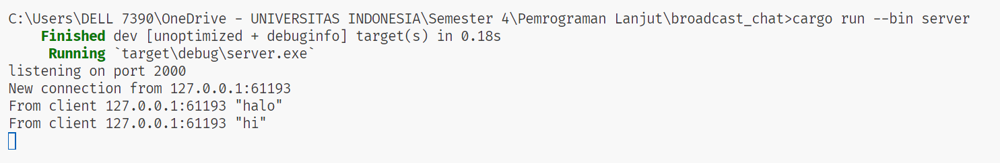
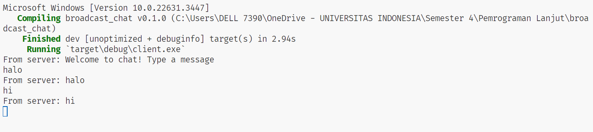
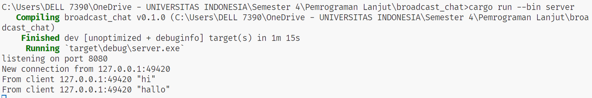
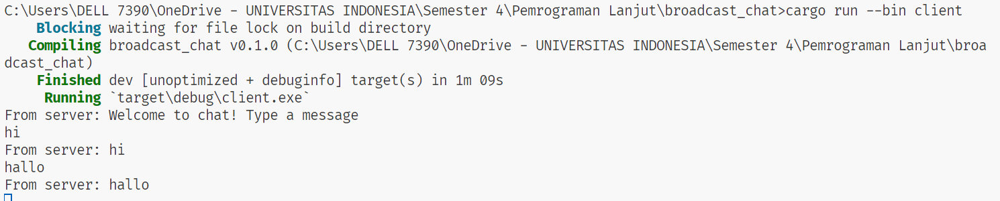
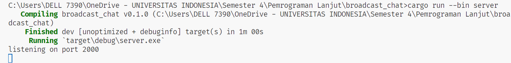
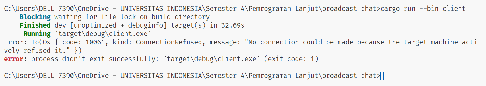
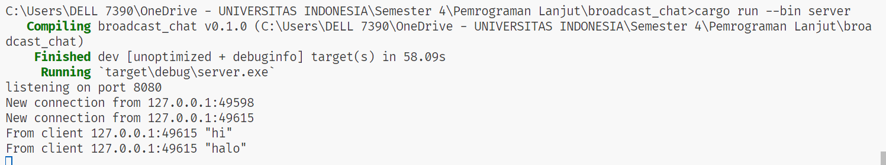
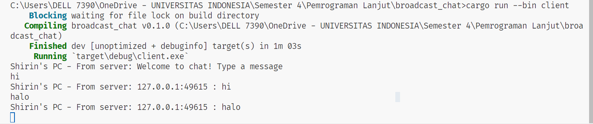

**2.1. Original code of broadcast chat.**  

Setelah menjalankan server menggunakan perintah `cargo run --bin server`, serta setiap klien menggunakan perintah `cargo run --bin client`, dari hasil keluaran di atas terlihat bahwa semua klien dan server menerima pesan obrolan dari setiap klien yang terhubung. Ketika seorang klien mengetikkan pesan di baris perintah, teks tersebut akan dikirim ke server dan kemudian diteruskan ke semua klien yang sedang terhubung.

**2.2. Modifying the websocket port**  
pada saat mengganti client dan server dengan port yang sama yaitu `8080` akan berjalan dengan baik seprti dibawah ini.

pada saat port server `2000` dan port client `8080` terlihat bahwa port client mengalami crash karena tidak punya koneksi ke server berikut.

**Experiment 2.3: Small changes, add IP and Port**

Perubahan yang dilakukan pada kode bin/server.rs adalah menambah informasi alamat IP pengirim ketika `bcast.tx` mengirim pesan ke setiap pelanggan. Informasi alamat IP tersebut disimpan ke dalam variabel addr.